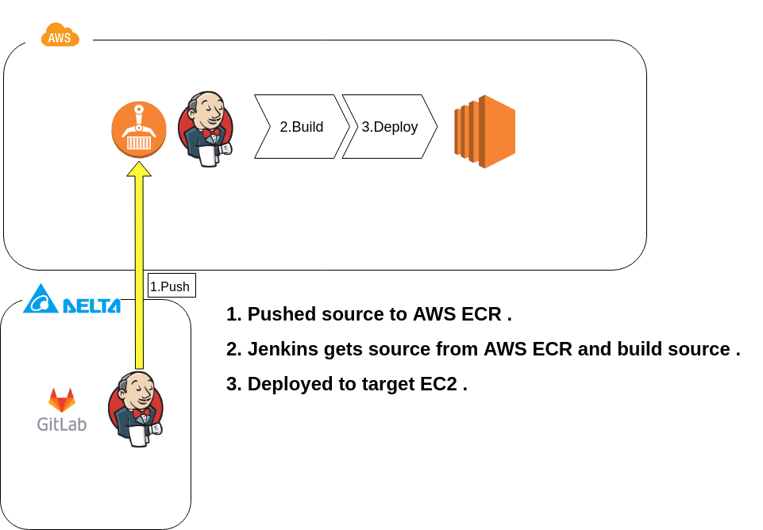
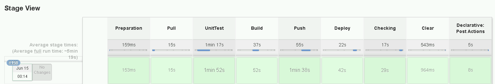
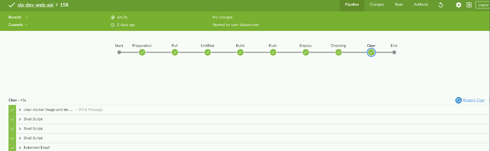
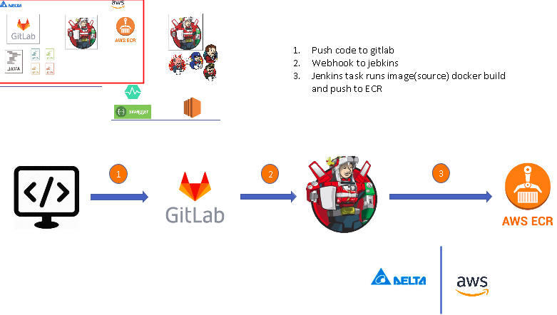
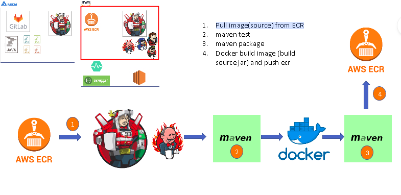
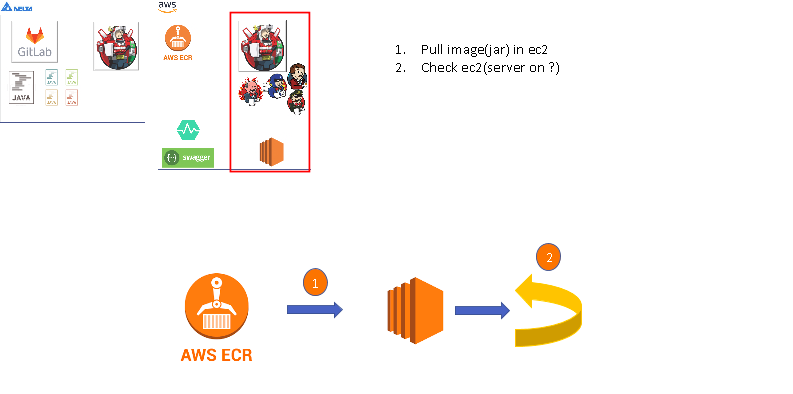
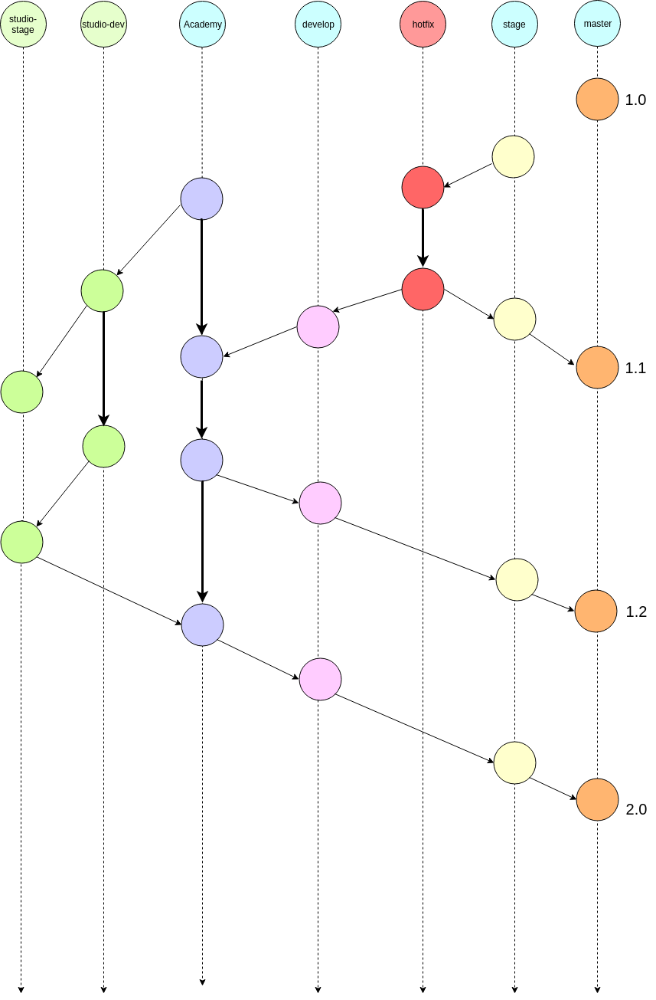
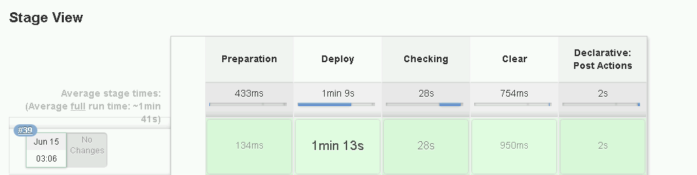
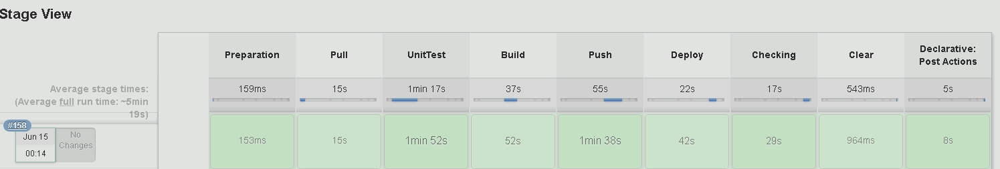

# Academy CI/CD Flow

----

> * The history of the e4e team
> * Infrastructure (AWS Cloud)
> * Git flow for team
> * Jenkins Pipeline Script
> * Future

---

## The history of the e4e team

> - Hard things for IT
>   - Submit application(VM , firewall policy ...etc) date is too long  .
>   - Changing firewall policy on go-live  .
>   - Block firewall policy without warning .
> - Hard things for team
>   - Deploying by manual .
>   - The team could not get AWS's console manage .
>   - Only one person maintained and developed back-end applications and infrastructure .   
>   - etc ... 

## Infrastructure

> * Reserved Original Deploy Method (dev -> stage -> master)  .
>
>   * Survey Code Deploy / Code build / Code Summit / Cloud Watch
>
> * Thinking in CICD from EV-charged .
>
>   
>
> * Focus problems and new mechanisms of team .  
>
>   * Unit-test
>* Email notification 
>   * Image version 
>* Reverse or Selection some version images
>   * Checking server live
>* Change log forward
>   
>* Integration SQA solution 
> 
> 
>    
>---
>    
> 
>    
> 
>    
> 
>    
>* Using AWS EC2 jenkins and delta jenkins to reach CI/CD . 
> 
>
>   
>---
>   
>
>   
>---
>   
>

---

## Git-Flow For E4E Team

> * Flow for e4e team
>
>   

---

## Jenkins Pipeline Script

> * template script . 
>
>   ```javascript
>   pipeline {
>       
>       agent {
>           label 'jenkins-security-slave'
>       }
>       
>       environment 
>       {
>           RUN_UNIT_TEST = "${params['RunUnitTest']}"
>           PROJECT = 'slp-security-web-api:latest'
>           PROJECT_BUILD = 'slp-security-web-api-build:latest'
>           ECRURL = 'http://180885420323.dkr.ecr.ap-southeast-1.amazonaws.com'
>           ECRCRED = 'ecr:ap-southeast-1:ecr-user'
>       }
>       
>       stages {
>           stage('Preparation'){
>               steps {
>                  echo "Preparation" 
>               }
>           }
>           
>           stage('Pull') {
>               steps {
>                   echo 'Pull image from ecr'
>                  
>               }
>              
>           }
>           stage('Deploy') {
>               steps{
>                   echo 'Deploy target ec2'
>                  
>               }
>           }
>           stage('Checking') {
>               steps {
>                   echo 'Check web server....'
>                   
>               }
>           }
>       }
>   }
>   ```
>
>   
>
> * 2 template scripts 
>
>   * stage , prod
>
>     
>
>   * develop 
>
>     
>
> * Reference
>
>   * [Jenkins pipeline document](https://jenkins.io/doc/book/pipeline/development/)
>
>     
>
>     

---

##  Future

>- Delta Jenkins will do CI things . (Only it)
>- Code Deploy in AWS , Aliyun cloud and hosts ...etc 
>- Completed Devops sprite (monitor , notification and scale alert ...etc )
>- Containerize application 
>- Connecting to JIRA system
>- Using Ansible to decrease shell script
>- Implement auto-rollback


